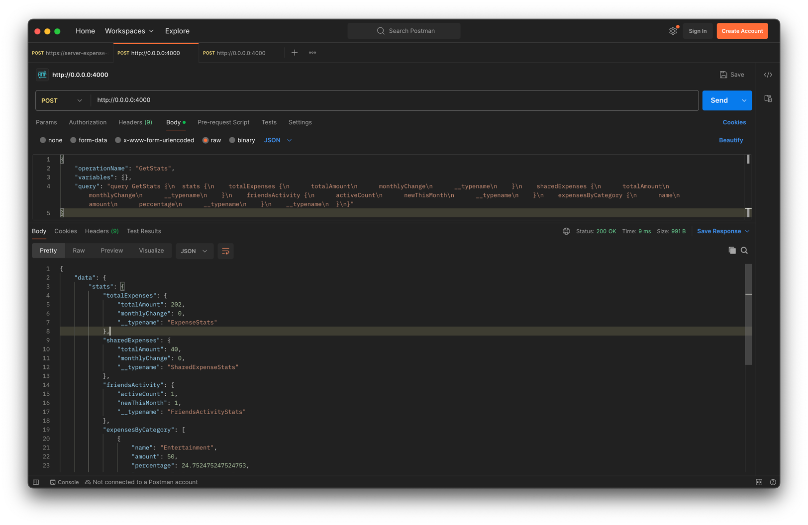
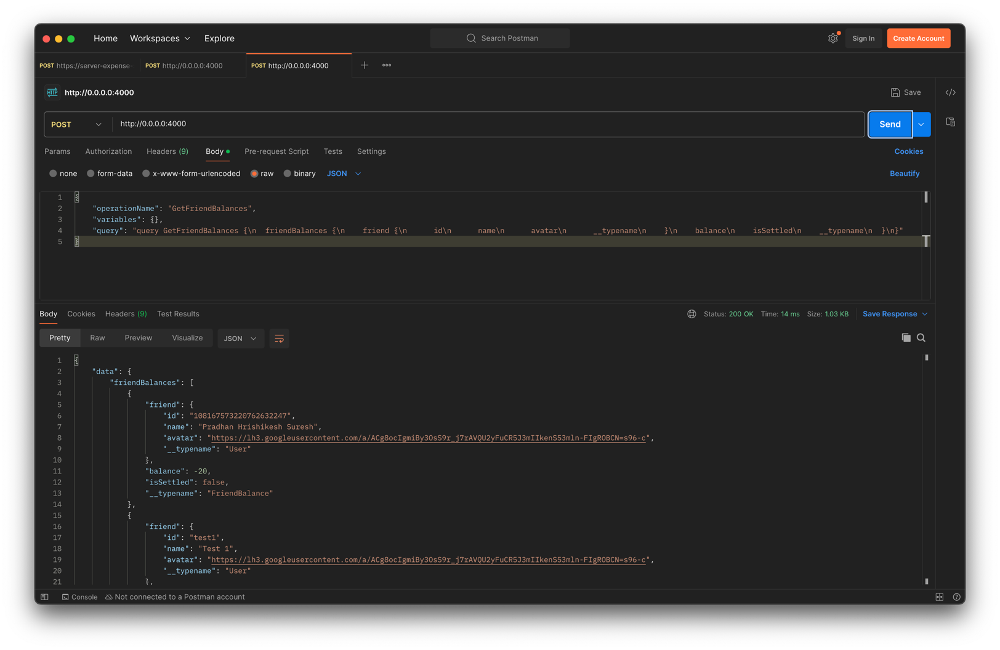
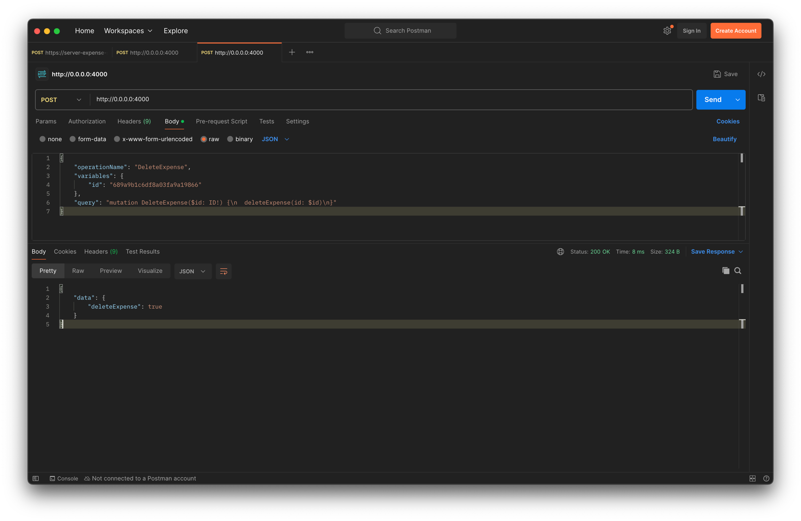
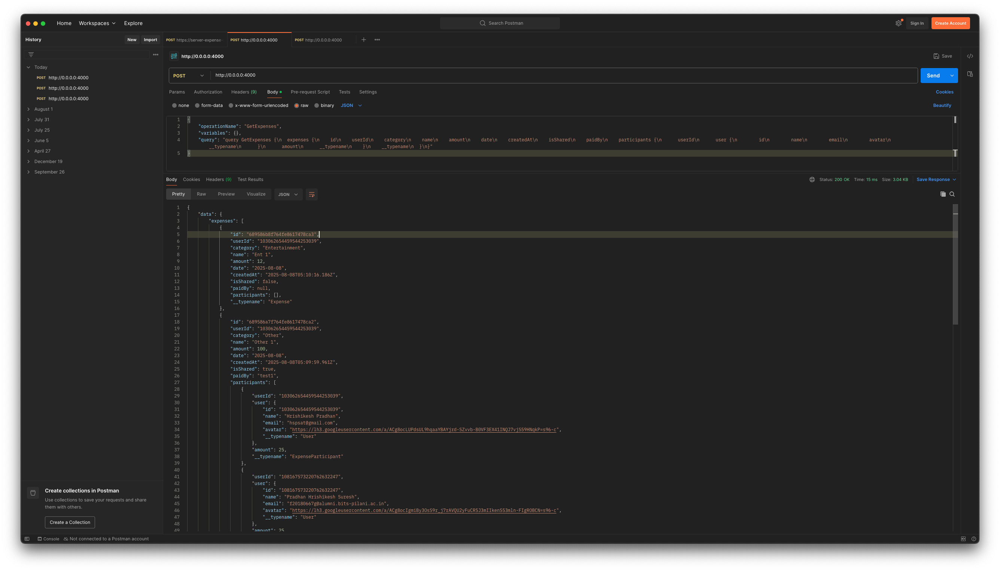
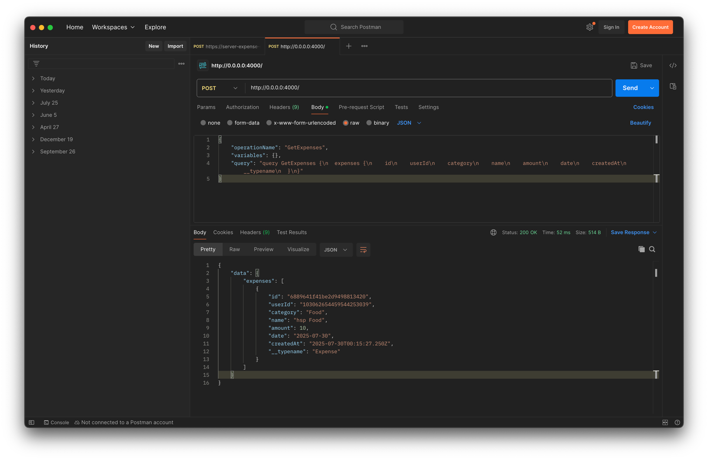
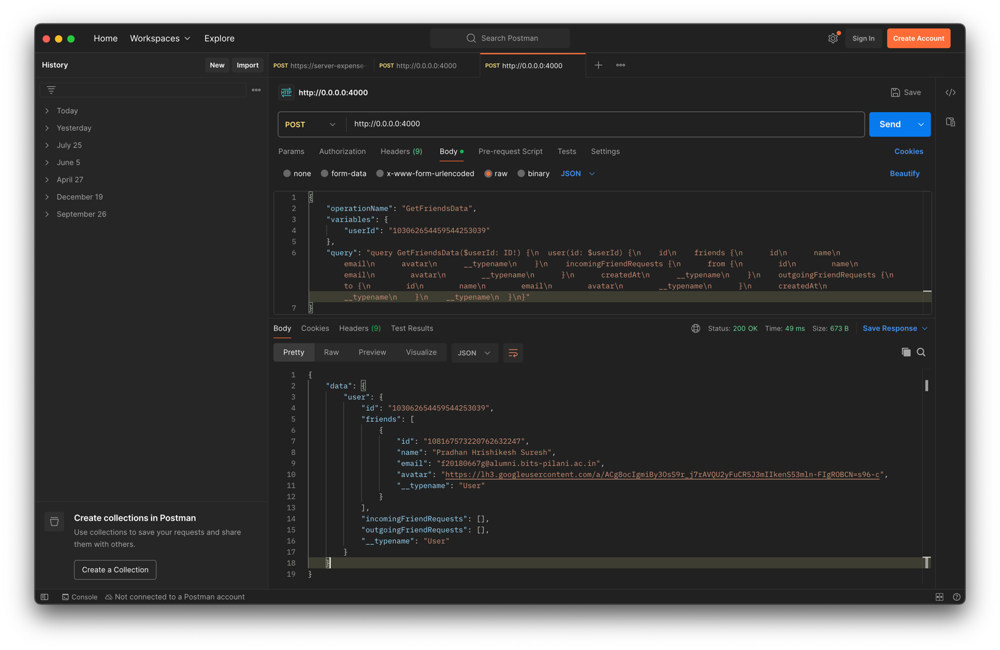

# Expense Share Backend

### Technologies Used:

- Node.js
- Apollo Server
- MongoDB
- GraphQL

#### Deployed at: https://server-expense-share.ue.r.appspot.com/
#### Frontend deployed at: https://client-expense-share.ue.r.appspot.com

## Iteration 3

### Requirements Fulfilled

- User interface with data by at least 2 CRUD operations (create, read, update, delete) for at least
  one database table
    - User can create expenses, read expenses and delete expenses.
    - User can create friend requests and update the request (accept/reject).
- At least 3 different UI routes (appearing to the user as different pages)
    - The application has three different routes:
        - `/expenses` - to view all expenses.
        - `/friends` - to view all friends and friend requests.
        - `/stats` - to view the summary statistics of the user.
- At least one Bootstrap UI component is not featured in the demo application
    - I have used Chakra UI (https://v2.chakra-ui.com/docs/components).
    - I have used many components from Chakra UI, such as `Button`, `Input`, `Modal`, `Avatar`,
      `Stat`, etc.
    - `Modal` is used to get user confirmation before deleting an expense and also used to enter
      user email address when adding friends.
    - `Toast` is used to show success or error messages to the user.
- Different layout and design from the demo application; it should not look like an obvious clone
    - The application has a different layout and design from the demo application.
- At least one of the following:
    - 3rd party library for React (not including React DnD, unless its use is completely different
      from the use in the demo project)
        - I have used:
          1. react-icons (https://react-icons.github.io/react-icons/)
          2. Recharts (https://recharts.org/en-US)
          3. chakra UI components (https://v2.chakra-ui.com/docs/components).
    - GraphQL interface to the database
        - I have used graphql for all api calls and mongoDB queries, using Apollo (https://www.apollographql.com/docs)
    - Significant use of Redux for all state handling (instead of useState)
        - NOT USED.

### Features

- Support to fetch balance of user with friends.
- Stats api to get summary statistics for the current user.
- Delete expense graphql api to delete an expense.

### Images
- MongoDB collections:
    - 
- Postman queries:
    - 
    - 
    - 

<hr style="height:4px; background-color:#e61212; border:none;" />

## Iteration 2

### Features

- Supports adding expenses with multiple users as participants.
- Support filtering expenses by user's googleID if they are a participant in the expense.
- Update the user's avatar URL in the database when a user logs in.

### Example GraphQL Queries



<hr style="height:4px; background-color:#e61212; border:none;" />

## Iteration 1

### Features

- This is the backend service for the Expense Share application, which handles provides Graphql
  APIs for managing expenses and users.
- Server defines the GraphQl schema, resolvers, and connects to a MongoDB database for data storage.
- Currently, you can register a new user and add expenses.
- Also, you can add other users as your friends (via email).

### How it works

- The server uses Apollo Server to create a GraphQL API.
- It connects to a MongoDB database to store user and expense data.
- The UI has to always send `HTTP POST` requests to the server with the GraphQL query in the body.

### Installation & Usage

1. Clone the repository:
2. Make sure you have MongoDB installed and running on your machine.
3. Environment variables:
    - `MONGO_DB_URL=mongodb://localhost:27017/`
    - `MONGO_DB_NAME=expense-share-db`
4. Run the following commands in the terminal:
    ```bash
    cd server
    npm install
    npm run start
    ```
5. The server will start running on `http://localhost:4000/`.

Deployed at: https://server-expense-share.ue.r.appspot.com/

### Example GraphQL Queries





The above example query will also need a `userId` in the header, which is the googleID of the user
whose expenses you want to fetch.

